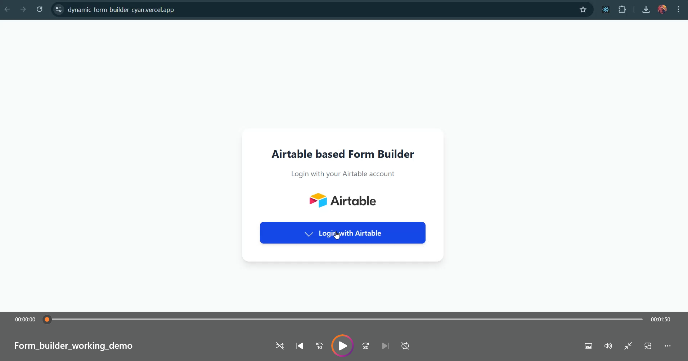
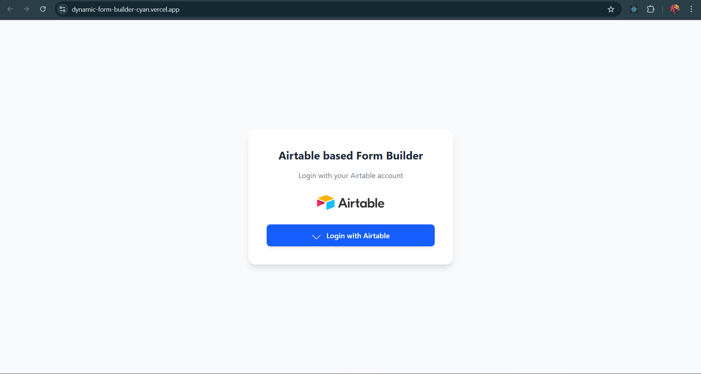
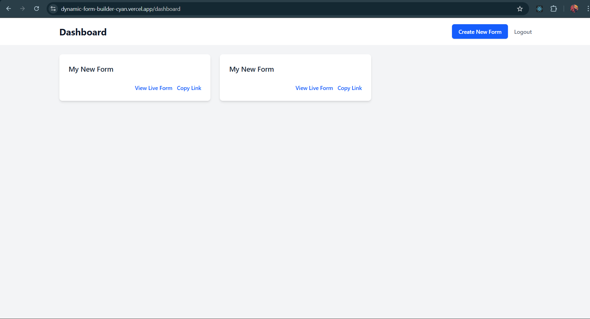
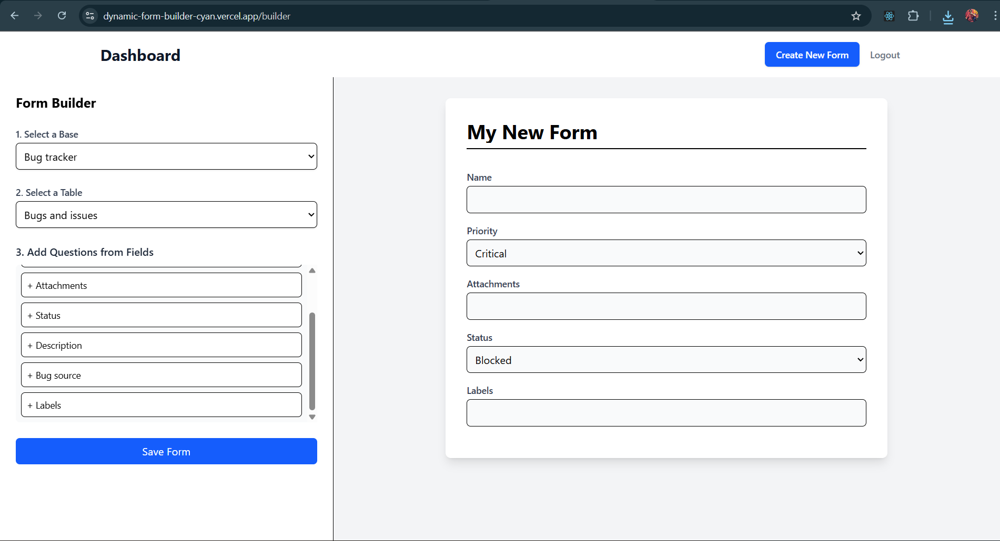
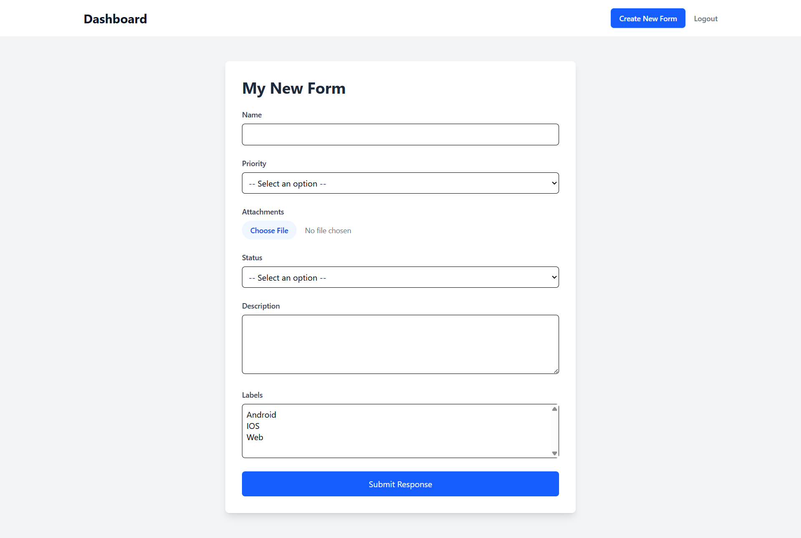

# Dynamic Airtable-Connected Form Builder

A full-stack MERN application that allows users to log in with their Airtable account, dynamically create custom forms from their Airtable bases, apply conditional logic to questions, and save form responses directly back into Airtable.

---

### **Live Links**

* **Live Site (Frontend):** [https://dynamic-form-builder-cyan.vercel.app/](https://dynamic-form-builder-cyan.vercel.app/)
* **GitHub Repository:** [https://github.com/nirban256/dynamic_form_builder/](https://github.com/nirban256/dynamic_form_builder/)

---

## Features

* **Secure Airtable OAuth 2.0 Login:** Users can securely log in using their Airtable account. The application handles the entire OAuth flow, storing access tokens and user information in a MongoDB database.
* **Dynamic Form Creation:** Users can select one of their Airtable bases and a specific table within that base to act as the data source for a new form.
* **Field Selection:** The application fetches all fields from the selected Airtable table and allows the user to choose which ones to include as questions in their form.
    * **Supported Field Types:** Short text, Long text, Single select, Multi-select, and Attachment.
* **Live Form Preview:** A real-time preview of the form is shown as the user adds and customizes questions.
* **Form Submission to Airtable:** Public-facing forms can be filled out, and on submission, the data is sent directly to the connected Airtable table as a new record.
* **Dashboard (Bonus Feature):** A user-friendly dashboard displays all forms created by the logged-in user, with quick links to view the live form or copy its URL.

---

## Tech Stack

* **Frontend:** React (with Vite), React Router, Tailwind CSS, Axios
* **Backend:** Node.js, Express.js
* **Database:** MongoDB (with Mongoose)
* **Authentication:** JWT (JSON Web Tokens), Airtable OAuth 2.0
* **Deployment:**
    * Frontend hosted on Vercel.
    * Backend hosted on Railway.

---

## Setup and Installation

To run this project locally, you will need to set up both the backend and frontend services.

### Backend Setup

1.  **Clone the repository:**
    ```bash
    git clone [https://github.com/nirban256/dynamic_form_builder.git](https://github.com/nirban256/dynamic_form_builder.git)
    cd dynamic_form_builder/backend
    ```

2.  **Install dependencies:**
    ```bash
    npm install
    ```

3.  **Create a `.env` file:**
    Create a `.env` file in the `backend` directory and add the environment variables listed in `.env.example` which you will find in the root directory itself. You will need to provide your MongoDB connection string, JWT secret, and Airtable credentials.

4.  **Run the server:**
    ```bash
    npm run dev
    ```
    The backend server will start on `http://localhost:5000` or the url you specify.

### Frontend Setup

1.  **Navigate to the frontend directory:**
    ```bash
    cd ../frontend
    ```

2.  **Install dependencies:**
    ```bash
    npm install
    ```

3.  **Create a `.env` file:**
    Create a `.env` file in the `frontend` directory and add the environment variable for the backend API URL as shown in `.env.example`.
    ```
    VITE_API_URL=http://localhost:5000
    ```

4.  **Run the client:**
    ```bash
    npm run dev
    ```
    The React application will start on `http://localhost:5173`.

---

## Airtable OAuth App Setup

To use the Airtable login functionality, you must create your own OAuth application in Airtable.

1.  Go to the [Airtable Developers](https://airtable.com/developers/apps) page and sign in.
2.  Click **"Create a new OAuth app"**.
3.  Fill in the application details:
    * **Name:** Dynamic Form Builder (or your preferred name)
    * **Website URL:** `https://dynamic-form-builder-cyan.vercel.app`
4.  **Set the Redirect URIs:** You can add two URIs and switch based on your environment:
    * For local development: `http://localhost:5000/api/auth/callback`
    * For the deployed site: `https://dynamicformbuilder-production-1559.up.railway.app/api/auth/callback`
5.  **Define Scopes:** Select the following scopes to allow the application to read and write data:
    * `data.records:read`
    * `data.records:write`
    * `schema.bases:read`
6.  Once created, Airtable will provide you with a **Client ID** and a **Client Secret**. Add these to your backend `.env` file.

---

## Explanation of Conditional Logic

Conditional logic allows users to create more interactive forms where questions are shown or hidden based on a user's previous answers.

### Implementation

* **Data Structure:** The logic for each question is stored in the `Form` model in MongoDB within the `questions` array. Each question can have a `condition` object:
    ```json
    {
      "fieldId": "fldABC123",
      "label": "What is your GitHub URL?",
      "condition": {
        "questionId": "fldXYZ789",
        "operator": "equals",
        "value": "Engineer"
      }
    }
    ```
    This structure means the "GitHub URL" question will only be shown if the answer to the question with `fieldId` "fldXYZ789" is "Engineer".

* **Frontend Logic:** In the `FormViewer` component, the user's answers are stored in the React state. Before rendering each question, the component checks if a `condition` object exists for it. If it does, it evaluates the condition against the current form state. The question is only rendered if the condition is met. This check happens in real-time as the user fills out the form, creating a dynamic experience.

---

## Video
[](./assets/Form_builder_working_demo.mp4)

---

## Screenshots

### Login Page:


### Dashboard:


### Form builder:


### Form view:
